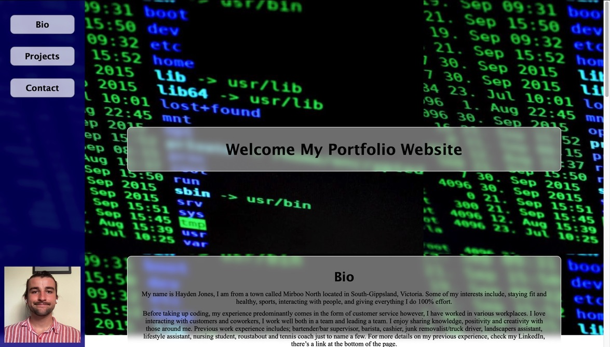

  <header align="center"> 
  <h1> 👓 My React Portfolio 👓 </h1> 
  </header>

# User-Story

    I want to employee Hayden Jones as a full stack web developer but want to see what he knows.

# Table of contents

- [User-Story](#user-Story)
- [Description](#Description)
- [Screenshots](#Screenshots)
- [Installations](#installations)
- [Usage](#usage)
- [License](#license)
- [Contributing](#Contributing)
- [Testing-Procedure](#Testing-Procedure)
- [Contact](#contact)

# Description

    Creating my first react app, I have transferred across my old portfolio code and made it in the structure of react.

# Screenshots

# Installations

    Type npm i to install dependencies.

# Usage

    To get a job.

# Contributing

    Pull requests and messaging are ideal for contributing.

# Testing-Procedure

    Don't break the code before uploading PR.

# Contact

If you would like to reach me in regards to either questions or comments, I am more than
happy to respond via github [Hayden-code](https://github.com/Hayden-code) or email [haychjones@gmail.com](haychjones@gmail.com).
